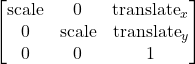

# Plan

Initially, I'm aiming to implement the core shape features of circles and triangles. These should be fairly straightforward
given that Graphics2D provides an ellipse abstraction. For the triangles, extending the Path2D class will provide the
necessary abstractions for a closed path based on a set of points, in this case vertices and allow for easy movement.

Labels should be fairly straightforward, the base label class will be used with four connection points, one on each side
of the bounding box in the centre of the side. Initially the second mouse click will designate the connection point to some
place on the canvas. Based on the location of that point relative to the corners of the bounding box, it will switch to
the nearest binding point on the sides of the bounding box.

Moving on to the transforms, this should be fairly straightforward using affine transforms. Each of the actions will be
distinct and capped actions, that map into the matrix as a combined transform:

* Scroll up: zoom in
* Scroll down: zoom out
* Middle-click + drag: pan 

Scrolling up and down will change the scale factor of the scale transform matrix, capped in the range (0, 2]. As for panning,
it will cap relative to the amount of un-rendered canvas space on the X and Y axis:

X_offset: [0, canvas_w - rendered_w)
Y_offset: [0, canvas_h - rendered_h)

Curves and arcs will be next, which will be generalised under the Spline class provided by Graphics2D. When drawing, at
least two points will need to be defined with the mouse, establishing the start and end points. Further, points drawn will
be used as control points to Bezier segments. There is a requirement of these being `3n+1` (Yay for Collatz conjecture )
in number, so this will cull points until a sufficient number of points are defined by the user.

A variation of cubic splines will be provided that uses JOCL OpenCL for performing Gauss-Jordan elimination to solve the
linear automations constituting the spline derivatives. This is not necessarily optimal for small matrices, but an interesting
optimisation to explore nonetheless.

Measurements should be fairly straightforward, this will be an option in a dropdown menu to enable measurement labels on
lines. This will be implemented with the label feature to bind to lines and curves with a pre-render hook. Each time a
line is required to be labelled, it will invoke a handler defined as part of the base element class (`LineElement`, `CircleElement`, etc).
A second option will be provided as well which will be a table with the distances indexed on it. This will be generated
with a HashMap reference passed to the hook which will change the label to a given text definition.

Grouped selection will be added as a further feature, allowing the application of affine transforms to a group of points.

Additional to this, the ability to fill in convex closed shapes will be added based on several fill types, such as solid,
striped and dotted.